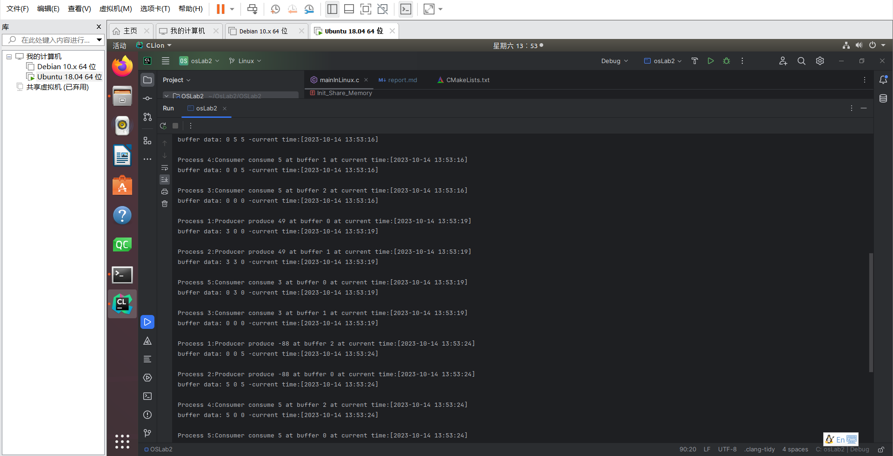
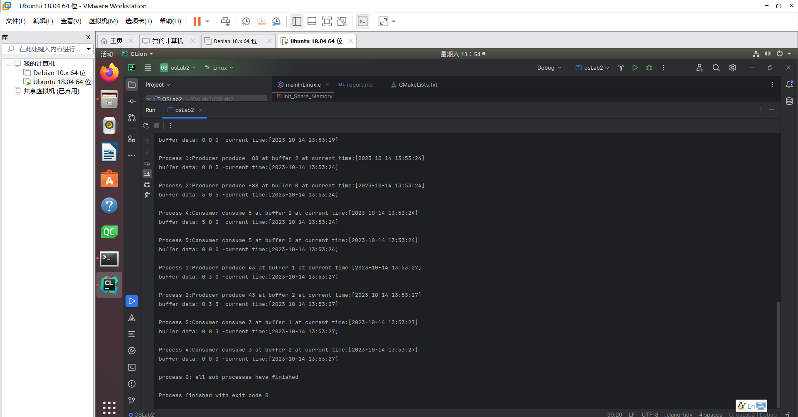

# 一、 实验目的
学习生产者与消费者的运行基本原理，学习使用共享内存区和信号量机制，\
学习使用多进程以及进程间通信的方法，学会使用锁互斥访问对象。
# 二、 实验内容
• 一个大小为 3 的缓冲区，初始为空\
• 2 个生产者\
– 随机等待一段时间，往缓冲区添加数据，\
– 若缓冲区已满，等待消费者取走数据后再添加\
– 重复 6 次\
• 3 个消费者\
– 随机等待一段时间，从缓冲区读取数据\
– 若缓冲区为空，等待生产者添加数据后再读取\
– 重复 4 次\
说明：\
• 显示每次添加和读取数据的时间及缓冲区里的数据（指缓冲区里的具体内容）\
• 生产者和消费者用进程模拟（不能用线程）\
• Linux/Window 下都需要做
# 三、 实验环境
Windows10\
VMWare16\
Ubuntu-18.04
# 四、 程序设计与实现
## 通用的简要设计思路：
### (1) 主进程
    负责创建公共信号量和共享内存区，以及创建并等待 2 个生产者子进程和 3 个消费者子进程
### (2) 共享内存区
    需要包括大小为 3 的缓冲区数组 a、缓冲区数据头部指针 beg、缓冲区数据尾部指针 end
### (3) 公共信号量
    共需 3 个，分别是：
    同步信号量 Filled，指示已填充的缓冲区个数，初值为 0
    同步信号量 Emptyed，指示为空的缓冲区个数，初值为 3
    互斥信号量 ReadWriteLock，类似读写锁，控制子进程互斥地使用缓冲区，初值为 1
### (4) 生产者子进程
    需要对共享内存区进行读写操作并在缓冲区内填入数据，
    这还涉及到信号量的申请与释放，其具体每次生产执行过程可以抽象为
    P(Emptyed); //申请空闲缓冲区资源
    P(ReadWriteLock); //申请对缓冲区修改的权限
    array[end]=x //在空缓冲区填入数据
    end=(end+1)%3 //尾部指针递增
    V(Filled); //填充了一个缓冲区，释放填充缓冲区信号量
    V(ReadWriteLock); //释放修改权限
    (5) 消费者子进程需要对共享内存区进行读写操作并在缓冲区内读出数据，
    其每次消费具体执行过程可以抽象为
    P(Filled); //申请已填充缓冲区资源
    P(ReadWriteLock); //申请对缓冲区修改的权限
    y=array[begin] //从已填充缓冲区读取数据
    beg=(beg+1)%3 //头部指针递增
    V(Emptyed); //读取了一个缓冲区，释放空缓冲区信号量
    V(ReadWriteLock); //释放修改权限
### (6) 生产者消费者子进程全部运行结束后
    主进程需要回收共享内存区和信号量
## 两个操作系统更具体的设计实现思路
    为方便查看，先说明宏定义
    生产者总数#define producerAmount 2  
    一个生产者生产出的数据量#define productProducedByOneProducer 6
    消费者总数#define consumerAmount 3
    一个消费者消费的数据量#define productConsumedByOneConsumer 4
    进程总量#define processAmount 5
    缓冲区大小#define bufferSize 3
### Ubuntu18.04

#### (1) 主进程和子进程
    主进程需要负责创建各对象，首先需要创建共享内存区，
    共享内存区创建完成后，需要创建信号量
    在本实验中采用 fork 函数创建子进程，
    故主进程在运行到 fork 时会产生分支，以 fork 返回的 pid 号区分
    进程，故主函数结构参考如下，注意循环使用 fork 函数产生子进程的操
    作结束后必须在循环内结束进程，不然子进程也会运行 fork 函数
    int main(int argc,char *argv[]){
    //create shared memory
    //create signal
    for(int i=1;i<=Cnt_Process;i++){
    int pid=fork();
    if(pid==0){
    //do sub process
    if(is producer)
    doProduce();
    else
    doConsume();
    return 0;
    }
    }
    //main process
    doOther();
    return 0;
    }
    主进程在各个对象创建完毕后需要用函数 wait 等待子进程结束，由于创
    建了 5 个子进程，只需要 5 次循环使用 wait(NULL)即可，最后注意解除
    共享内存区和信号量
#### (2)共享内存区
    共享内存区通过函数 shmget 获取，第一个参数为随意设置的一个关键值，
    第二个参数即为 share_memory 大小，第三个参数设置为 0666|IPC_CREAT，
    表示创建新内存区，所有用户均有读写权限，shmget 会返回引用标识符。
    创建完成后可使用函数 shmat 通过引用标识符将该内存区附加到进程内，
    shmat 返回值为指向实际连接到的地址的指针，然后可以通过该指针对
    共享内存区进行加入数据和移出数据
    对于主进程，需要初始化共享内存区，对于子进程，可以生产或消费缓
    冲区数据，但注意在操作结束后使用 shmdt 解除进程对该共享内存区的
    附加。并且在主进程的最后需要使用函数 shmctl 删除内存区，
    其中 IPC_RMID 参数表示标记该内存区可删除
#### (3) 信号量
    信号量通过函数 semget 创建，第一个参数为随意设置的一个关键值，第 
    二个参数为信号总数量，此处设置为 3 ，第三个参数设置为
    0666|IPC_CREAT，意义同共享内存区内相同参数，其返回值为引用标识
    符。之后即可通过 semctl 函数对信号量做具体设置，具体参考如下
    int semid=semget(SEMKEY,3,0666|IPC_CREAT);
    semctl(semid,0,SETVAL,3); //empty
    semctl(semid,1,SETVAL,0); //fill
    semctl(semid,2,SETVAL,1); //rw
    由于创建之后子进程需要对信号量做 PV 操作，需要用到 semmop 函数
    和 sembuf 结构，这里将 P、V 操作封装为两个函数方便调用，输入信号
    量集应用标识符 semid 和信号量索引 n，可对第 n 个信号量单独做 P、V 
    操作。
    //P V操作代码:
    void P(int semid,int n){
    struct sembuf temp;
    temp.sem_num=n;
    temp.sem_op=-1;
    temp.sem_flg=0;
    semop(semid,&temp,1);
    }
    void V(int semid,int n){
    struct sembuf temp;
    temp.sem_num=n;
    temp.sem_op=1;
    temp.sem_flg=0;
    semop(semid,&temp,1);
    }
    在主函数的最后需要使用函数 semctl(semid,IPC_RMID,0)删除 semid 对应的信号量
#### (4)生产者进程
    首先需要指向共享内存区的指针 sm，，然后每个生产者均需要重复 productProducedByOneProducer 次生产操作，故
    需要一个循环结构，在每次循环内，生产者首先调用 Sleep 等待随机的
    一段时间，然后开始正式的生产执行操作，首先进行 P 操作
    P(semid,0); //empty
    P(semid,2);
    然后就是往缓冲区生产填充数据，这里需要通过指针 sm 进行操作，思
    路已在通用设计思路中提及，这里省略具体操作
    然后进行 V 操作
    V(semid,1); //fill
    V(semid,2); 
    重复 productProducedByOneProducer 次生产过程，解除共享内存区附加，该生产者子进程结束
#### (4)消费者进程
    首先需要指向共享内存区的指针，然后每个消费者均需要重复 productConsumedByOneConsumer 次消费操作，故
    需要一个循环结构，在每次循环内，消费者首先调用 Sleep 等待随机的
    一段时间，然后开始正式的消费执行操作，首先进行 P 操作
    P(semid,1); //fill
    P(semid,2); 
    取出数据的具体操作同生产数据
    然后进行 V 操作
    V(semid,0); //empty
    V(semid,2); 
    重复 productConsumedByOneConsumer 次消费过程，解除共享内存区附加，该消费者子进程结束
#### (5)主进程结束
     调用 5 次 wait(NULL)等待 5 个子进程结束，然后用上文说明的方法删除共享内存区和信号量集。
#### (6)运行结果
          见文件夹下的1.png 2.png 3.png

